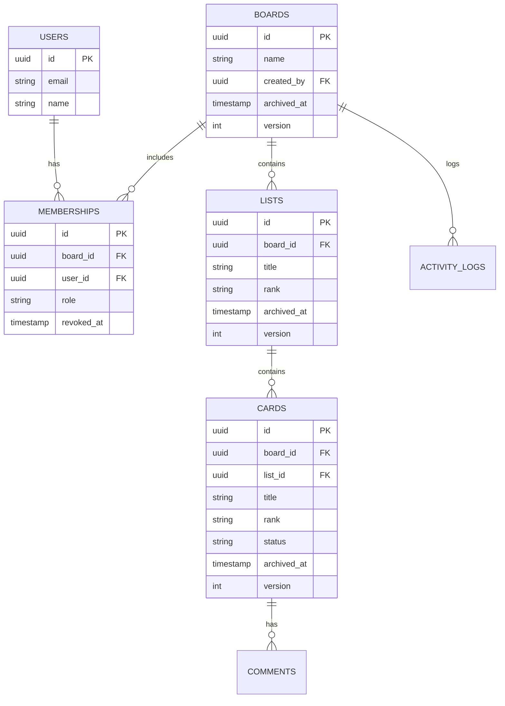
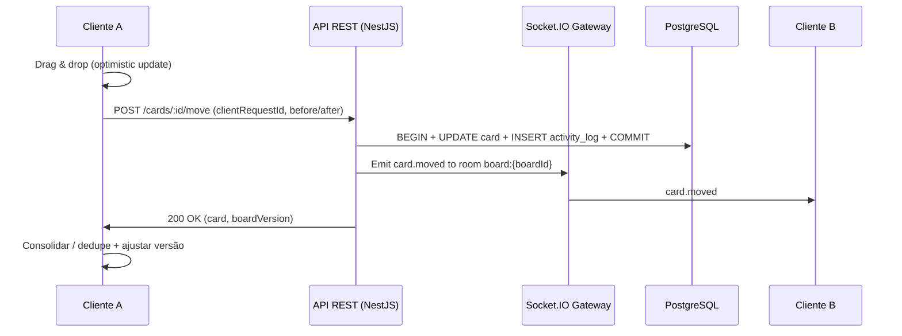

# kanban_engineering_spec_v2

```md
# Antigravity Execution Protocol (Mandatory)

You must implement this project incrementally with small, verifiable steps.

## Repo Layout (Monorepo)
- /apps/web (Next.js + TS)
- /apps/api (NestJS + TS)
- /packages/shared (domain types, zod schemas, DTOs, WS event contracts)

## Package Manager
Use PNPM for the monorepo.

## Work Method
- Implement ONE step at a time.
- After each step:
  1) run lint + typecheck + build
  2) ensure dev environment runs
  3) create a git commit with a clear message `feat(step-XX): ...`

## Definition of Done for each Step
A step is DONE only if:
- code compiles
- app runs locally
- acceptance criteria for the step are met

## Mandatory Tests
- Implement unit tests for the ranking module (rank generation / insertion between ranks).
- Add at least smoke tests for critical API endpoints.

## Contracts are Source of Truth
- All REST DTOs and WebSocket event payloads must be defined in /packages/shared.
- Frontend and Backend must import and use these contracts directly.
- Do not invent payload shapes.

## Real-time Rules
- WebSocket auth via JWT.
- Rooms: `board:{boardId}`.
- Server must validate user access before joining a room.
- Broadcast events only to the relevant board room.
```

## Resumo executivo

Este arquivo define, sem ambiguidades, as instruções para um agente de IA iniciar e conduzir a implementação de um **sistema web Kanban básico (tipo Trello)** com **colaboração em tempo real** e suporte a **até 30 usuários simultâneos**. O objetivo é obter **fluidez** (drag & drop consistente e rápido), **simplicidade operacional** (arquitetura monolítica modular, com contratos compartilhados), e **robustez** (atualização otimista com rollback, versionamento por entidade, reordenação eficiente por ranking).

A implementação deve seguir um **monorepo** com `apps/web`, `apps/api` e `packages/shared`, usando **PNPM**, **TypeScript** ponta a ponta, contratos de dados em **Zod**, e um módulo isolado de **ranking** com testes unitários obrigatórios.

Stack alvo (padrão, não negociável neste v2):
- **Frontend**: Next.js + React + dnd-kit + TanStack Query + TanStack Virtual (sob demanda)
- **Backend**: NestJS
- **Tempo real**: WebSocket com **Socket.IO**
- **DB**: PostgreSQL
- **Cache**: Redis **opcional** (não usar no MVP salvo necessidade explícita)

Tudo que não estiver explicitamente definido aqui deve ser tratado como **não especificado** e não deve ser inventado pelo agente.

## Requisitos e escopo mínimo viável

### Objetivos do projeto

O sistema deve permitir que equipes de engenharia:
- Visualizem e atualizem a distribuição de tarefas em um quadro Kanban compartilhado.
- Movam cartões entre listas com drag & drop e persistência de ordem.
- Colaborem em “tempo real leve”: ao modificar o quadro, os demais usuários conectados no mesmo board devem receber atualizações automaticamente.
- Mantenham histórico operacional (auditoria) e evitem perdas por exclusão física.

### Escopo mínimo viável

O MVP inclui:

**Quadros (boards)**
- Criar, renomear, listar e abrir boards.
- Arquivar boards (soft delete por `archived_at`).
- Exclusão física: **proibida**.

**Listas (lists/colunas)**
- Criar, renomear, reordenar (drag & drop) e arquivar listas.
- Exclusão física: **proibida**.

**Cartões (cards/tarefas)**
- Criar, editar (título e descrição), mover entre listas e reordenar dentro da lista (drag & drop).
- Campos mínimos: título, descrição, status simples, responsável (opcional).
- Arquivar cartões.
- Exclusão física: **proibida**.

**CRUD mínimo**
- CRUD operacional nos recursos acima, respeitando política de arquivamento.

**Comentários**
- Criar e listar comentários por cartão.
- Editar/excluir comentário: **não especificado** (padrão v2: não implementar edição/exclusão).

**Membros e permissões básicas**
- Usuários pertencem a um board via membership.
- Roles por board: `owner`, `member`, `viewer`.
- Permissões:
  - `owner`: gerencia membros/roles e arquiva board.
  - `member`: cria/edita/move/arquiva listas e cartões; comenta.
  - `viewer`: somente leitura.
- Regras adicionais (ex.: permissões por lista): **não especificado**.

### Fora de escopo do MVP

Não implementar no MVP:
- Etiquetas, anexos, checklists avançados, automações, busca avançada, notificações push, offline-first.
- Colaboração avançada tipo editor colaborativo (CRDT). Isso fica no roadmap.

## Stack e arquitetura alvo

### Estrutura do repositório

Monorepo obrigatório:

```
/apps/web
/apps/api
/packages/shared
```

Regras:
- **Contratos** (DTOs REST, payloads de eventos, tipos do domínio e validações Zod) vivem em `/packages/shared`.
- Frontend e backend importam contratos **do shared**; nenhum lado “reinventa” shape de payload.

### Frontend

Tecnologias:
- Next.js + React + TypeScript
- dnd-kit para drag & drop
- TanStack Query para cache/fetch/invalidations e atualização otimista
- TanStack Virtual para virtualização (ativar somente quando listas tiverem muitos itens; ver requisitos de performance)
- Tailwind CSS (ou alternativa): **não especificado** (padrão v2: usar Tailwind)

Padrões:
- Estado “fonte da verdade” no client: cache do TanStack Query + store leve (se necessário) apenas para UI (drag overlays, modals).
- Ordenação de cards e listas deve ser derivada de `rank` vindo do servidor.

### Backend

Tecnologias:
- NestJS + TypeScript
- REST API + WebSocket Gateway (Socket.IO)
- Validação de DTO obrigatória com Zod (reusando schemas do shared)
- Camadas mínimas:
  - controller (REST)
  - gateway (WS)
  - service (regras de negócio)
  - repository (persistência)

Padrões:
- Transações no Postgres para operações de move/reorder e logs.
- Emissão de evento WS somente **após** commit bem-sucedido.

### Banco de dados

Tecnologias:
- PostgreSQL
- Migrações SQL versionadas (via ferramenta: **não especificado**; padrão v2: usar migrações do Prisma ou TypeORM — decisão: **Prisma**)

Política:
- Não usar exclusão física para boards/lists/cards/comments/activity_logs.
- Memberships: remoção lógica por `revoked_at` (não excluir linha).

## Modelo de dados e ordenação

### Modelo de dados simplificado

Abaixo está o modelo mínimo (campos extras podem existir, mas não substituir estes).

| Entidade/Tabela | Propósito | Campos mínimos | Regras/Índices |
|---|---|---|---|
| `users` | Identidade do usuário | `id uuid pk`, `email text unique`, `name text`, `password_hash text`, `created_at timestamptz`, `updated_at timestamptz` | `unique(email)` |
| `boards` | Quadro Kanban | `id uuid pk`, `name text`, `created_by uuid fk users`, `created_at`, `updated_at`, `archived_at null`, `version int` | índice em `created_by`; `version` inicia em 1 |
| `memberships` | Usuário no board | `id uuid pk`, `board_id uuid fk`, `user_id uuid fk`, `role text`, `created_at`, `revoked_at null`, `invited_by uuid fk users (não especificado)` | `unique(board_id,user_id)` (considerar apenas `revoked_at is null`) |
| `lists` | Colunas | `id uuid pk`, `board_id uuid fk`, `title text`, `rank text`, `created_at`, `updated_at`, `archived_at null`, `version int` | índice `(board_id, rank)` |
| `cards` | Tarefas | `id uuid pk`, `board_id uuid fk`, `list_id uuid fk`, `title text`, `description text`, `status text`, `assigned_to uuid fk users null`, `rank text`, `created_by uuid fk users`, `created_at`, `updated_at`, `archived_at null`, `version int` | índice `(list_id, rank)` e índice `board_id` |
| `comments` | Comentários | `id uuid pk`, `card_id uuid fk`, `author_id uuid fk users`, `body text`, `created_at timestamptz`, `archived_at null` | índice `(card_id, created_at)` |
| `activity_logs` | Auditoria append-only | `id bigserial pk`, `board_id uuid fk`, `actor_user_id uuid fk`, `event_type text`, `entity_type text`, `entity_id uuid`, `payload jsonb`, `created_at timestamptz` | índice `(board_id, created_at)` |

Regras de arquivamento:
- Um item com `archived_at != null` não aparece por padrão nos endpoints de listagem.
- O backend deve filtrar por padrão `archived_at is null`.
- Restauração de itens arquivados: **não especificado** (não implementar no MVP).

### Estratégia de ordenação

#### Decisão v2

Implementar ordenação por **rank lexicográfico (string)**, gerado pelo servidor via **fractional indexing** (estilo LexoRank).

Regras:
- `rank` é uma string ordenável lexicograficamente.
- Para inserir/mover um item entre dois vizinhos, gerar uma nova chave “entre”.
- Nunca “renumerar tudo” (evitar update em massa).
- Rebalanceamento:
  - deve existir uma rotina administrativa para recalcular ranks quando houver “densidade” excessiva (manual via endpoint admin: **não especificado**).
  - no MVP, basta implementar o algoritmo e deixar observado que rebalance é uma melhoria posterior.

#### Exemplos concretos de rank

Considere ranks dentro de uma lista:
- Card A: `rank="a0"`
- Card B: `rank="a5"`
- Card C: `rank="b0"`

Inserir entre A (`a0`) e B (`a5`) → gerar algo entre: `a2` (exemplo).
Mover Card C do fim para entre A e B → novo rank: `a3` (exemplo).

Importante:
- O rank real deve ser gerado por função determinística do servidor (não “inventar” no cliente).
- O cliente pode sugerir `beforeRank` e `afterRank`, e o servidor calcula `newRank`.

#### Contrato do módulo de rank

O agente deve criar em `/packages/shared`:

- `rank.ts` (ou `rank/index.ts`)
  - `rankBetween(before: string | null, after: string | null): string`
  - `rankInitial(): string` (opcional)
- testes unitários cobrindo:
  - inserir no início (`before=null`, `after=firstRank`)
  - inserir no fim (`before=lastRank`, `after=null`)
  - inserir no meio
  - sequência de 50 inserções entre os mesmos dois ranks (não deve falhar)
  - ranks devem manter ordenação consistente (`before < new < after` quando aplicável)

## Colaboração em tempo real e consistência

### Modelo de tempo real

- Realtime via Socket.IO.
- Sala por board: `board:{boardId}`.
- O servidor só permite join se o usuário tiver membership ativa no board.
- O servidor emite eventos para a sala do board após operações persistidas.

### Convenções de eventos

Todo evento deve carregar:
- `eventId` (uuid)
- `boardId`
- `boardVersion` (incrementa a cada mutation persistida no board)
- `actorUserId`
- `serverTime` (ISO string)
- payload específico do evento

Idempotência/dedupe:
- Mutations enviadas pelo cliente devem conter `clientRequestId` (uuid).
- O servidor deve tratar `clientRequestId` como idempotente por `(actorUserId, clientRequestId)` por janela de tempo (persistência dessa dedupe: **não especificado**; MVP: in-memory LRU no backend é aceitável).

### Eventos obrigatórios

| Evento | Payload mínimo | Quando emitir | Como aplicar no cliente |
|---|---|---|---|
| `board.snapshot` | `{eventId, boardId, boardVersion, board, lists, cards, memberships}` | No join da sala e quando o cliente estiver desatualizado | Substituir store do board por snapshot; limpar pendências locais |
| `list.created` | `{eventId, boardId, boardVersion, actorUserId, list}` | Após criar lista | Inserir lista e ordenar por `rank` |
| `list.updated` | `{eventId, boardId, boardVersion, actorUserId, list}` | Após renomear/reordenar | Patch replace por `list.id`; reordenar se rank mudou |
| `list.archived` | `{eventId, boardId, boardVersion, actorUserId, listId, archivedAt}` | Após arquivar | Remover da visão ativa; revalidar cards da lista (podem ser ocultados) |
| `card.created` | `{eventId, boardId, boardVersion, actorUserId, card}` | Após criar card | Inserir card na lista correspondente; ordenar por rank |
| `card.updated` | `{eventId, boardId, boardVersion, actorUserId, card}` | Após editar campos | Patch replace por `card.id` respeitando `version` |
| `card.moved` | `{eventId, boardId, boardVersion, actorUserId, cardId, fromListId, toListId, newRank, cardVersion}` | Após mover/reordenar | Aplicar move (trocar listId/rank), reordenar lists afetadas |
| `card.archived` | `{eventId, boardId, boardVersion, actorUserId, cardId, archivedAt}` | Após arquivar | Remover da visão ativa |
| `comment.created` | `{eventId, boardId, boardVersion, actorUserId, comment}` | Após criar comentário | Append no thread do card; opcional: incrementar contador |

Observação:
- Presença (quem está online no board): **não especificado** (não implementar no MVP).

### Atualização otimista e rollback

O padrão obrigatório:

- O cliente aplica imediatamente a mudança (optimistic).
- O cliente envia request REST.
- Se falhar (`4xx/5xx`), rollback para snapshot anterior.
- Se sucesso, consolida; quando receber o evento WS correspondente, aplica dedupe por `clientRequestId` ou por igualdade de `cardVersion/boardVersion`.

### Resolução de conflitos

Estratégia v2:

- **Last-write-wins (LWW)** no servidor.
- Cada entidade mutável (`boards`, `lists`, `cards`) possui `version` inteiro incrementado a cada update persistido.
- O cliente aplica um patch recebido se:
  - `incoming.version > local.version`, ou
  - `incoming.version == local.version` e local não possui mutation pendente para o mesmo campo

Soft-locks (apenas UX):
- Quando usuário abre modal de edição de card, o cliente pode emitir `card.editing_started` e `card.editing_ended` com TTL curto.
- O servidor não bloqueia updates; o frontend apenas mostra aviso “em edição”.
- Implementar soft-locks: **não especificado** (padrão v2: não implementar no MVP; preparar contratos se desejar).

## API e contratos

### Regras de contrato

- Toda request/response REST e payload WS devem existir em `/packages/shared`.
- O backend valida entrada com Zod.
- O frontend valida responses críticas com Zod (pelo menos para mutations).

### Endpoints REST essenciais

| Método | Rota | Payload mínimo | Resposta esperada |
|---|---|---|---|
| POST | `/auth/login` | `{email, password}` | `{user, accessToken}` *(token JWT; storage: cookie HttpOnly)* |
| POST | `/auth/logout` | `{}` | `204` |
| GET | `/me` | — | `{user}` |
| GET | `/boards` | — | `[{id, name}]` |
| POST | `/boards` | `{name}` | `{board}` |
| GET | `/boards/:boardId` | — | `{board, lists, cards, memberships, boardVersion}` |
| PATCH | `/boards/:boardId` | `{name}` | `{board}` |
| POST | `/boards/:boardId/archive` | `{}` | `{board}` |
| GET | `/boards/:boardId/members` | — | `[{userId, role}]` |
| POST | `/boards/:boardId/members` | `{userId, role}` | `{membership}` |
| PATCH | `/boards/:boardId/members/:userId` | `{role}` | `{membership}` |
| DELETE | `/boards/:boardId/members/:userId` | — | `204` *(server seta `revoked_at`)* |
| POST | `/boards/:boardId/lists` | `{title, beforeListId?, afterListId?}` | `{list}` |
| PATCH | `/lists/:listId` | `{title?}` | `{list}` |
| POST | `/lists/:listId/reorder` | `{beforeListId?, afterListId?}` | `{list}` *(rank atualizado)* |
| POST | `/lists/:listId/archive` | `{}` | `{list}` |
| POST | `/lists/:listId/cards` | `{title, description?, beforeCardId?, afterCardId?}` | `{card}` |
| PATCH | `/cards/:cardId` | `{title?, description?, status?, assignedTo?}` | `{card}` |
| POST | `/cards/:cardId/move` | `{toListId, beforeCardId?, afterCardId?, clientRequestId, baseCardVersion?}` | `{card, boardVersion}` |
| POST | `/cards/:cardId/archive` | `{}` | `{card}` |
| GET | `/cards/:cardId/comments` | — | `[{id, authorId, body, createdAt}]` |
| POST | `/cards/:cardId/comments` | `{body}` | `{comment}` |
| GET | `/boards/:boardId/activity` | `?limit?cursor` | `[{id, eventType, entityType, entityId, payload, createdAt}]` |

GraphQL:
- Implementar GraphQL: **não especificado** (padrão v2: não implementar no MVP).

### Exemplos de payloads JSON

**Request: mover card**
```json
{
  "toListId": "7f3b6f9d-3f6a-4b2e-9ad8-8a9a4f3f0a1b",
  "beforeCardId": "11111111-1111-1111-1111-111111111111",
  "afterCardId": "22222222-2222-2222-2222-222222222222",
  "clientRequestId": "c0c3a7c0-7fb8-4f70-9ed2-38b1b8c43a94",
  "baseCardVersion": 12
}
```

**Response: mover card**
```json
{
  "card": {
    "id": "5ff5a9a2-6f94-4ae4-9f6f-6e0a1b9b0b01",
    "boardId": "8c7a6d6b-3b2f-4b51-8d5d-8e9e1d1cb901",
    "listId": "7f3b6f9d-3f6a-4b2e-9ad8-8a9a4f3f0a1b",
    "title": "Revisar desenho do dispositivo",
    "description": "Checar interferências e tolerâncias.",
    "rank": "a3Z",
    "status": "ACTIVE",
    "assignedTo": null,
    "version": 13,
    "updatedAt": "2026-02-11T13:20:10.123Z"
  },
  "boardVersion": 1042
}
```

**Evento WS: card.moved**
```json
{
  "eventId": "f7a88e3d-42ea-4c46-8f3b-1d7fbdc6a3d1",
  "boardId": "8c7a6d6b-3b2f-4b51-8d5d-8e9e1d1cb901",
  "boardVersion": 1042,
  "actorUserId": "99999999-9999-9999-9999-999999999999",
  "serverTime": "2026-02-11T13:20:10.150Z",
  "cardId": "5ff5a9a2-6f94-4ae4-9f6f-6e0a1b9b0b01",
  "fromListId": "11111111-1111-1111-1111-111111111111",
  "toListId": "7f3b6f9d-3f6a-4b2e-9ad8-8a9a4f3f0a1b",
  "newRank": "a3Z",
  "cardVersion": 13
}
```

## Operação, deploy, observabilidade, testes e roadmap

### Instruções operacionais obrigatórias para o agente Antigravity

Além do patch do topo, aplicar:

- Criar `docker-compose.yml` **apenas** para PostgreSQL local.
- Criar `seed` que gere:
  - 1 usuário `owner`
  - 3 usuários `member`
  - 1 board demo com 3 listas e 10 cards distribuídos
- Incluir scripts PNPM:
  - `pnpm dev` (sobe web + api + db)
  - `pnpm test` (unit + e2e)
  - `pnpm lint`, `pnpm typecheck`, `pnpm build`

### Diagramas e documentação

O agente deve incluir em `docs/` e referenciar no README:

- ER diagram em Mermaid
- Fluxo de eventos em Mermaid

**ER diagram (Mermaid)**


**Fluxo de eventos (Mermaid)**


### Infra e deploy iniciais

Requisitos de deploy (inicial) com baixo atrito:
- Frontend Next.js: deploy em **Vercel** ou **Cloudflare Pages** (não especificado qual; padrão v2: Vercel).
- Backend NestJS (container): deploy em **Render** ou **Fly.io** ou **Cloud Run** (não especificado qual; padrão v2: Fly.io).
- Banco: PostgreSQL gerenciado em **Neon**, **Supabase** ou Postgres managed (não especificado qual; padrão v2: Neon).

### Observabilidade

Obrigatório no MVP:
- Logs estruturados no backend (JSON).
- Request correlation id em toda requisição (REST) e em toda mutation WS.
- Captura de erro no frontend e backend via Sentry: **não especificado** (padrão v2: implementar Sentry).
- Métricas mínimas:
  - latência de `/cards/:id/move`
  - taxa de erro por endpoint
  - contagem de conexões WS ativas por board

### Testes

Obrigatórios:
- Unit tests do módulo de rank (ver seção de ranking).
- Smoke tests REST para endpoints críticos (login, criar board, criar card, mover card).
- Teste E2E mínimo com dois “usuários” simulados:
  - abrir board em dois browsers
  - mover card em um
  - observar atualização automática no outro (evento WS)

Framework E2E:
- Playwright ou Cypress: **não especificado** (padrão v2: Playwright).

### Roadmap por fases

Fase MVP (curta, base sólida):
- Autenticação, boards/lists/cards/comments/memberships/roles
- Ranking e drag & drop persistente
- Eventos essenciais (snapshot + mutations)
- Seed e docker-compose
- OpenAPI gerado e versionado

Fase tempo real leve (aprimoramento):
- boardVersion e resync/snapshot automático quando necessário
- dedupe robusto por clientRequestId/eventId
- otimizações de payload (emit incremental vs snapshot)

Fase colaboração avançada (somente se necessário):
- CRDT para edição concorrente de texto (descrição longa, docs internos)
- presença avançada e soft-locks completos

### Checklist de entrega para o agente

Artefatos obrigatórios:
- Monorepo PNPM com `apps/web`, `apps/api`, `packages/shared`
- Contratos Zod no shared (DTOs e eventos WS)
- Migrações SQL (ou migrações via Prisma) + seed
- Implementação do módulo `rank` + testes unitários
- REST API completa (endpoints essenciais) + autenticação JWT em cookie HttpOnly
- Socket.IO Gateway com salas `board:{boardId}` e autorização
- UI Kanban com drag & drop (dnd-kit)
- Atualização otimista (TanStack Query) com rollback
- Diagramas Mermaid em `docs/`
- README com setup local + deploy inicial + DoD
- Commits incrementais seguindo `feat(step-XX): ...`

### Prioridades e trade-offs

Prioridades:
- Fluidez do drag & drop e consistência visual.
- Simplicidade (monólito modular) antes de microserviços.
- Contratos compartilhados para evitar divergências entre web e api.

Trade-offs assumidos neste v2:
- LWW simplifica conflitos, mas pode sobrescrever mudanças concorrentes em campos específicos; mitigar com avisos de UI e activity logs.
- Rebalance de ranking não entra no MVP; fica como melhoria planejada.
- Presença/soft-locks completos ficam fora do MVP.

### Segurança, autenticação e autorização

Decisão v2:
- JWT para autenticação.
- Armazenar token em **cookie HttpOnly** (evitar expor token ao JavaScript); detalhes de refresh token: **não especificado** (MVP pode usar access token com expiração moderada e re-login).
- Autorização por membership/role no backend em todas as rotas.
- Verificação de acesso ao board antes de:
  - responder snapshot
  - entrar na sala do Socket.IO
  - aceitar mutations no board